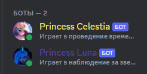
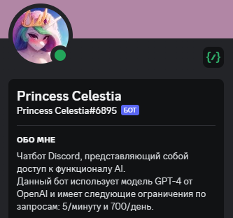
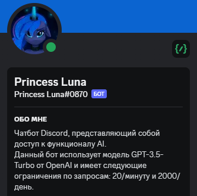

<div align="center" id="top"> 
  
</div>

<h1 align="center">Discord AI Compose Project</h1>

<p align="center">
  
  
  
  
  
  
  
</p>

<hr>

<p align="center">
  <a href="#dart-о-проекте">О проекте</a> &#xa0; | &#xa0;
  <a href="#sparkles-особенности">Особенности</a> &#xa0; | &#xa0;
  <a href="#rocket-технологии">Технологии</a> &#xa0; | &#xa0;
  <a href="#white_check_mark-требования">Требования</a> &#xa0; | &#xa0;
  <a href="#checkered_flag-начало">Начало</a> &#xa0; | &#xa0;
  <a href="#memo-лицензия">Лицензия</a> &#xa0; | &#xa0;
  <a href="https://github.com/orgs/laspegasuscommunity/people" target="_blank">Авторы</a>
</p>

<br>

## :dart: О проекте

Проект Discord AI от команды LasP Team представляет собой мощный и гибкий инструмент, позволяющий общаться с AI ботами в Discord. Наша цель - создать интерактивное и увлекательное взаимодействие с ботами, чтобы участники серверов могли наслаждаться уникальным опытом общения.

- Интеграция с OpenAI: Мы используем передовую технологию OpenAI для обеспечения высококачественных и интеллектуальных ответов от наших AI ботов.
- Гибкая настройка: Пользователи могут настраивать параметры ботов, чтобы они соответствовали их потребностям и предпочтениям.
- Множество функций: Наши AI боты обладают различными способностями, включая ответы на вопросы, предоставление информации, шутки и многое другое.
- Легкая установка: Установка и настройка Discord AI проста и понятна даже для новичков!

<div align="center" id="top"> 
  
  
</div>

## :sparkles: Особенности

:heavy_check_mark: Важнейшая особенность контейнеров — их сравнительно короткий жизненный цикл. Любой контейнер можно остановить, перезапустить или уничтожить, если это необходимо. Данные, которые содержатся в контейнере, при этом тоже пропадут. Так выработалось правило проектирования приложений: не хранить важные данные в контейнере. Такой подход называют Stateless;\
:heavy_check_mark: Объем контейнеров измеряется в мегабайтах, поскольку в них упаковывают лишь те процессы и зависимости ОС, которые необходимы для выполнения кода. Легковесные контейнеры быстро запускаются и экономят место на диске;\
:heavy_check_mark: Один контейнер соответствует одному запущенному процессу. Отключение отдельного контейнера для отладки или обновления никак не помешает нормальной работе всего приложения;\
:heavy_check_mark: Контейнеризация обеспечивает надежную изоляцию процессов и повышает уровень безопасности систем. Приложения, которые работают внутри контейнера, не имеют доступа к основной ОС и не могут на неё влиять;\
:heavy_check_mark: Благодаря контейнерам можно автоматизировать развертывание приложений на разных хостах;\
:heavy_check_mark: Использование контейнеров позволяет перейти с монолита на микросервисную архитектуру. За счет этого ускоряется разработка новой функциональности, поскольку нет опасений, что изменения в одной компоненте затронут всю остальную систему;\
:heavy_check_mark: С точки зрения эффективности контейнеры котируются выше виртуальных машин. На одинаковом оборудовании можно запустить большое количество контейнеров, тогда как ВМ будет в разы меньше. Это важно при использовании облачной инфраструктуры — потребуется меньше ресурсов;

## :rocket: Технологии

В данном проекте были использованы следующие инструменты:

- [Docker](https://www.docker.com/)
- [Docker Compose](https://docs.docker.com/compose/)

## :white_check_mark: Требования

Перед началом :checkered_flag:, вам нужно иметь [Git](https://git-scm.com) и [Docker](https://www.docker.com/) установленными.

## :checkered_flag: Начало

```bash
# Клонируйте этот проект
$ git clone https://github.com/laspegasuscommunity/discord-ai.git

# Доступ
$ cd discord-ai

# Отредактируйте celestia.env и luna.env для указания токенов Discord ботов и Naga API ключа
$ nano celestia.env
$ nano luna.env

# Запустите проект
$ docker-compose up -d
```

## :memo: Лицензия

Этот проект находится под лицензией AGPL-3.0. Для получения более подробной информации см. [LICENSE](LICENSE) файл.

<h4 align="right"> 
	Сделано с :heart: <a href="https://github.com/orgs/laspegasuscommunity/people/ponfertato" target="_blank">ponfertato</a>
</h4>

&#xa0;

<h4 align="center"> 
	<a href="#top">Вернуться к началу 🔝</a>
</h4>
